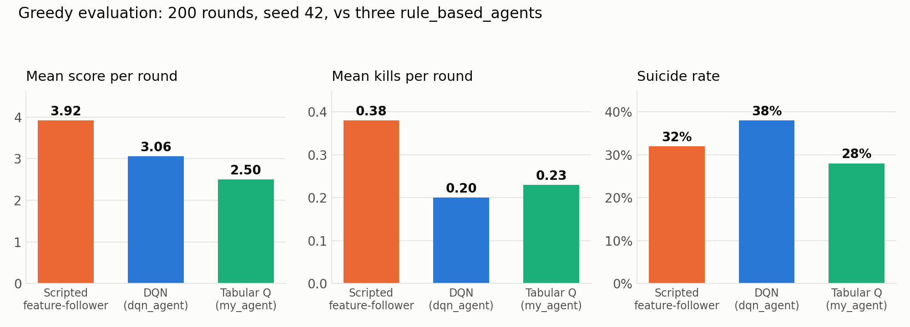

# Smurfer: Reinforcement Learning for Bomberman

Final project of **Team Smurfer** for *Machine Learning Essentials*, Summer Semest
er 2026,
Heidelberg University. We train agents to play a four-player version of Bomberman
and compare
a tabular Q-learner, a deep Q-network, and a scripted control that uses the same f
eatures
without any learning.

**Team:** Michael Ale · Prasun Kumar Bhuin · Sahil Chavda

The game framework is the course's
[bomberman_rl](https://github.com/ukoethe/bomberman_rl) environment; everything un
der
`agent_code/smurfer`, `agent_code/dqn_agent`, `agent_code/my_agent` and
`agent_code/feature_follower`, and the scripts at the top level, is our work.

---

## Agents

| Agent | Folder | What it is |
|---|---|---|
| **Smurfer** (submitted) | `agent_code/smurfer` | Our tournament agent: the train
ed deep Q-network below, packaged for submission. |
| Deep Q-network | `agent_code/dqn_agent` | Dueling n-step Double DQN on a 9-chann
el 17×17 board encoding plus 21 scalar features. 453,895 parameters. |
| Tabular Q-learning | `agent_code/my_agent` | n-step Q-learning over a hand-desig
ned 9-field state abstraction (2,483 states visited). |
| Scripted control | `agent_code/feature_follower` | Follows the same hand-crafted
 features with no learning. Used only to measure what learning adds; not a submiss
ion. |

`smurfer` and `dqn_agent` contain the same trained model; `dqn_agent` is the devel
opment
folder that the training script writes to.

All agents share an exact simulation of the game's bomb timing (`game_utils.py`),
which tells
them for every tile whether and when it becomes lethal, and whether an escape stil
l exists.

## Results

Greedy evaluation (no exploration, no learning), 200 rounds, seed 42, classic scen
ario,
against three `rule_based_agent`s:

| Agent | Score / round | Coins / round | Kills / round | Suicide rate |
|---|---|---|---|---|
| Scripted control | **3.92** | 2.05 | 0.38 | 32% |
| Deep Q-network (Smurfer) | 3.06 | 2.04 | 0.20 | 38% |
| Tabular Q-learning | 2.50 | 1.36 | 0.23 | 28% |
| Best rule-based opponent | 3.10 – 3.59 | | | |

Ablation: the same deep agent with an optional rule-based **safety filter** that v
etoes
provably fatal actions (500 rounds, seed 42):

| | Score / round | Suicide rate | Invalid actions / round |
|---|---|---|---|
| Filter off (as submitted) | 3.10 | 36.0% | 8.22 |
| Filter on | **3.53** | **20.2%** | **3.27** |

The main finding: the learned agents decline about 42% of bombing opportunities th
at their
own features mark as safe and useful, which we trace to action-dependent reward sh
aping.



## Setup

Python 3.10 or newer.

```bash
git clone https://github.com/Michael-ale000/smurfer.git
cd smurfer
pip install -r requirements.txt
```

`pygame-ce` is only needed for the game window; everything also runs headless with
 `--no-gui`.

## Usage

### Watch the agent play

```bash
python3 main.py play --my-agent smurfer                  # against three rule_base
d_agents
python3 main.py play --my-agent smurfer --turn-based     # one step per key press
python3 main.py play --agents smurfer my_agent rule_based_agent peaceful_agent
```

Enable the safety filter from the ablation:

```bash
DQN_SAFE_ACT=1 python3 main.py play --my-agent smurfer
```

### Train

Both trainers walk the agent through the four curriculum stages of the project she
et
(coin-heaven alone → loot-crate alone → classic vs weak agents → classic vs rule-b
ased agents).

```bash
python3 train_dqn.py --fresh       # deep agent, full curriculum (~5 hours on a la
ptop CPU)
python3 train_agent.py --fresh     # tabular agent, full curriculum
python3 train_dqn.py --quick       # 40 rounds per stage, to check the pipeline ru
ns
python3 train_dqn.py --stages 3 4  # only later stages, continuing from the saved
model
```

### Evaluate

```bash
python3 evaluate_agent.py --agent dqn_agent --n-rounds 200 --seed 42
python3 main.py play --my-agent smurfer --no-gui --n-rounds 500 --seed 42 --save-s
tats results/smurfer.json
```

Results are written to `results/` as JSON.

### Figures, tests and inspection

```bash
python3 plot_training.py --agent dqn_agent   # training curves from training_histo
ry.pt
python3 make_figures.py                      # comparison and analysis figures in
figures/
python3 tests/test_features.py               # feature encoding and bomb-timing te
sts
python3 tests/test_dqn.py                    # network, quantisation and replay bu
ffer tests
python3 inspect_state.py --step 60           # print a game state as the agent rec
eives it
```

### Package the agent for submission

```bash
python3 make_submission.py --agent smurfer --out my-submission.zip
```

Checks the agent folder (trained parameters present, no absolute paths, no multipr
ocessing,
no imports from outside the folder), plays one test game the way the graders do, a
nd only then
writes the zip.

## Repository layout

```
agent_code/
  smurfer/            submitted agent (deep Q-network)
  dqn_agent/          deep agent development folder
  my_agent/           tabular Q-learning agent
  feature_follower/   scripted control
  ...                 agents provided by the framework (rule_based_agent, peaceful
_agent, ...)
train_dqn.py          curriculum trainer, deep agent
train_agent.py        curriculum trainer, tabular agent
evaluate_agent.py     greedy evaluation against chosen opponents
make_figures.py       figures used in the report
plot_training.py      training curves
make_submission.py    checks and packages an agent for the tournament
inspect_state.py      prints the game state an agent sees
tests/                unit tests
notes/                exploration notebook for the bomb-timing utilities
figures/              generated figures
main.py, environment.py, settings.py, ...   game framework
```

Each agent folder has its own `README.md` describing its files and design.

## Tournament constraints

The submitted agent runs on a single CPU thread, loads its model once in `setup`,
and needs
about 0.2 ms per step, far inside the 0.5 s limit. It uses only `numpy` and `torch
`, both
available in the tournament image.
